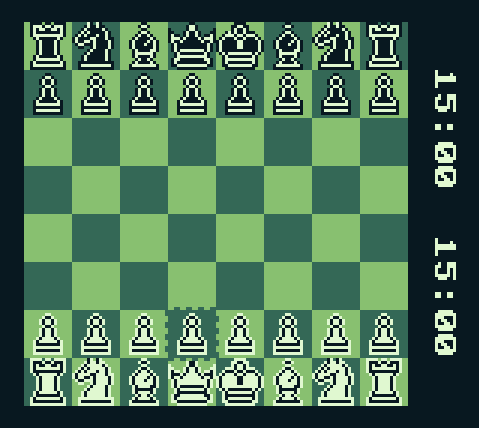

## Programming Chess from scratch for the original Gameboy

Chess piece Pixel Art was created by BerryArray, downloaded [here](https://berryarray.itch.io/chess-pieces-16x16-one-bit)

### done:
- rom compiles -> [last compiled rom](/compiled_roms) (not tested on original hardware! Use at own risk!)
- game playable -> regular moves working
- all special rules/moves implemented:
    first Pawn move, Castling, Promotion, En passaint, Draw and Checkmate, moves leaving King under attack not possible
- replay mode
- chess clock
- end game screen
- menu to adjust chess clock
- at start of turn, move cursor to last moved piece
- title screen

### to do:
- writing a short Manual in Markdown
- calculating and displaying material advantage

### maybe with a lot of enthusiasm:
 - rudimentary chess bot to play against
 - playable through link cable

 Also a lot of playtesting to find bugs should be done!