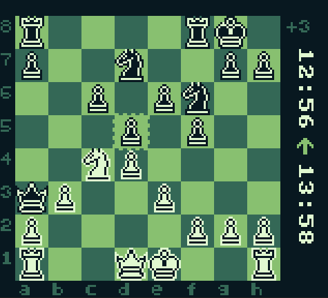

## Programming Chess from scratch for the original Gameboy

chess piece Pixel Art was created by BerryArray, downloaded [here](https://berryarray.itch.io/chess-pieces-16x16-one-bit)

current status:
- rom compiles -> [last compiled rom](/compiled_roms) (not tested on original hardware! Use at own risk)
- game playable -> regular moves working
- all special rules/moves implemented:
    first Pawn move, Castling, Promotion, En passaint, Draw and Checkmate, Moves leaving King under attack not possible
- replay mode

left to implement:
- end game screen
- option for a player to resign or offer a draw
- chess clock
    - font for digits
    - menu to set/reset time
    - keeping track of time
    - ending, when time ran out
- after selecting a piece, only legal squares are selectable
- calculating and displaying material advantage

 maybe with a lot of enthusiasm:
 - rudimentary chess bot to play against
 - playable through link cable

 Also a lot of playtesting to find bugs should be done!